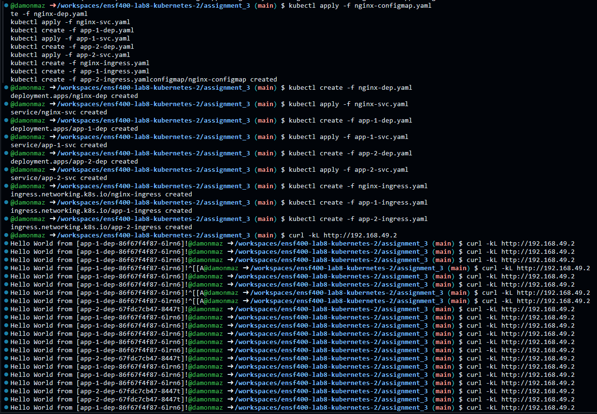

### How to Run this Assignment

NOTE: I am assuming that this is being done in 

1. Start Minikube and neccesary addons
```bash
minikube start
```
```bash
minikube addons enable ingress
```


2. Apply every .yaml file
```bash
kubectl apply -f nginx-configmap.yaml
kubectl create -f nginx-dep.yaml
kubectl apply -f nginx-svc.yaml
kubectl create -f app-1-dep.yaml
kubectl apply -f app-1-svc.yaml
kubectl create -f app-2-dep.yaml
kubectl apply -f app-2-svc.yaml
kubectl create -f nginx-ingress.yaml
kubectl create -f app-1-ingress.yaml
kubectl create -f app-2-ingress.yaml
```


3. Check that the deployments, services, and ingresses have been applied correctly and are currently running
```bash
kubectl get deployments
```
```bash
kubectl get services
```
```bash
kubectl get ingresses
```


4. Get the IP to be user in curl commands (This IP will most likely be 192.168.49.2)

```bash
minikube ip
```


5. Test connectivity
```bash
curl -kL http://<IP ADDRESS>
or
curl -kL http://192.168.49.2
```
Example Output:


6. Once finished, delete everything
```bash
kubectl delete -f nginx-configmap.yaml
kubectl delete -f nginx-dep.yaml
kubectl delete -f nginx-svc.yaml
kubectl delete -f app-1-dep.yaml
kubectl delete -f app-1-svc.yaml
kubectl delete -f app-2-dep.yaml
kubectl delete -f app-2-svc.yaml
kubectl delete -f nginx-ingress.yaml
kubectl delete -f app-1-ingress.yaml
kubectl delete -f app-2-ingress.yaml
```